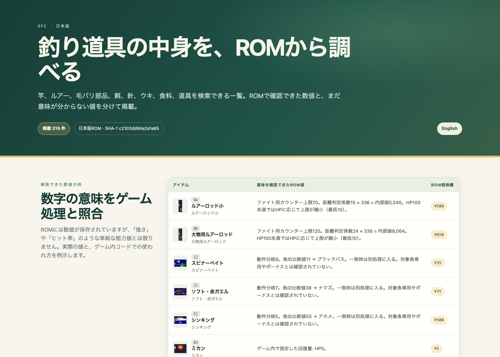

# 『川のぬし釣り2』（SFC）調査資料

スーパーファミコン版『川のぬし釣り2』を対象に、アイテムのROMレコード、毛バリの部品、実機相当のゲーム実行で確認した一部の効果を記録する個人研究です。ゲーム本体は配布しません。

**言語:** [English](README.md) · [調査結果（日本語）](docs/findings.ja.md) · [Findings (English)](docs/findings.en.md) · [日本語アイテムカタログ](catalogue/index.ja.html) · [English item catalogue](catalogue/index.html)

**画像付きカタログ:** [English](https://polaminggkub-debug.github.io/kawa-no-nushi-tsuri-2-research/catalogue/) · [日本語](https://polaminggkub-debug.github.io/kawa-no-nushi-tsuri-2-research/catalogue/index.ja.html)



実行時画像の取得方法: [日本語の手順](docs/runtime-capture.ja.md)。

## 調査対象

現在の調査インデックスは315件です。ゲーム内表示名が同じでも、IDが異なるものは別のROMレコードとして数えています。

| 分類 | 件数 | 数え方 |
| --- | ---: | --- |
| 竿 | 21 | 竿レコード |
| ルアー | 81 | ルアーレコード。同じ表示名でも別レコードの場合があります |
| 毛バリ部品 | 134 | ボディ64件、ウイング47件、テイル23件 |
| ハリ・アユの鼻環 | 13 | ハリ／鼻環レコード |
| ウキ・オモリ | 10 | ウキ、目印、オモリのレコード |
| エサ | 23 | エサレコード |
| 食べ物 | 10 | 食べ物・回復アイテム |
| 道具・クエスト品・音声設定 | 23 | ステレオ／モノラル設定も含み、所持品だけの数ではありません |
| **合計** | **315** | 調査インデックスの件数 |

毛バリ作成画面で直接確認した選択肢と、部品IDとの対応に残る制約は[調査結果](docs/findings.ja.md#毛バリ作成で確認したこと)に記載しています。件数は、すべての効果を解明したという意味ではありません。

## ROMテーブル抽出の再現

日本版SFC ROMのダンプをご自身で用意してください。本資料のROM解析は、サイズ1,572,864バイト、SHA-1 `c2103dd94e2a1a65a495fc02adc2e7d040f31212`、SHA-256 `e0594921a5a2ef1a2613b9d2e29fed066569e3793393c591bf4c4968a54c0b49` のダンプを対象にしています。

```sh
python3 scripts/extract_items.py --rom /path/to/your/Kawa-no-Nushi-Tsuri-2.sfc --output /tmp/items.json
```

抽出スクリプトはPython標準ライブラリのみを使います。ROMを読み取り、指定先に結果を書き出します。ROMのパッチや書き換えは行いません。別のダンプでは別ビルドとして扱い、レコード比較の前に検証してください。

任意の画面取得補助スクリプトは `scripts/capture.py` です。ユーザー自身が用意したSnes9x互換Libretroコアと、Pythonの `numpy`・`Pillow` が必要です。掲載した制御下のゲーム内測定は、隔離したエミュレーター実行で行いました。同じ試行状態に入るための元セーブステートは配布していないため、再現する場合はゲーム内で状態を作るか、ご自身のステートを用意してください。

## 数値と記述の読み方

- ROMの各フィールドは、その値を使うコードの処理に基づいて説明しています。意味や単位が確認できていない値を、プレイヤー向けの能力値として扱っていません。
- 円の価格はアイテムレコードに入っている値です。全ての店や全てのエリアで販売される証明にはなりません。
- 食べ物の効果は、HPを1にした条件での測定値です。魚を食べたときの回復量は試したサイズの範囲で確認しています。あらゆる条件での端数処理などは未確認です。
- アイテム名やルアー／毛バリの大分類は、コミュニティの一覧を手がかりにしました。ルアーID `0x11` と `0x1D` の訂正はROM内の名前データとゲーム画面で照合しています。
- 毛バリ作成の選択肢数は、序盤の店一軒で観察した結果です。他の店に追加選択肢がないという意味ではありません。
- カタログ画像はアイテム識別と画面表示の確認に用いたゲーム画面・説明書の資料です。画像の権利は各権利者に帰属します。ソフトウェア／データ向けのライセンスは画像の利用許諾を与えません。

## 収録物と対象外

調査用リポジトリには、選別したアイテムデータ、スクリプト、日英の調査説明、簡易カタログを収録します。ROM、パッチ、エミュレーター／コアの実行ファイル、セーブステート、説明書全ページの画像、ゲーム動画は収録しません。参照先は元の公開ページへリンクしています。

別途作成した全6エリアの魚マップとクエストメモは、出典に基づくプレイ用資料です。ROMから解読した事実として、このアイテム調査と混同しないでください。

## 参考資料

- SFC版の説明書写真とページ参照: [『川のぬし釣り2』説明書](https://gamemanual.midnightmeattrain.com/entry/%E5%B7%9D%E3%81%AE%E3%81%AC%E3%81%97%E9%87%A3%E3%82%8A2)。道具と釣り方は印刷ページ12–29。
- コミュニティによるアイテムID一覧（照合前の手がかりとして使用）: [SFC 川のぬし釣り2 改造コード](https://roadbikebeginners.com/sfc-kawanonushitsuri2-cheat/)。
- ルアー釣りやプレイ中の挙動についてのプレイヤー記録: [ルアー釣り](https://note.com/holy_heron2678/n/na12caa0f2974?hl=en)、[ルアー破損の記録](https://note.com/holy_heron2678/n/n433005d8fe08?hl=en)、[渓流釣りの記録](https://note.com/holy_heron2678/n/nf6dccee118e2?hl=en)。
- 道具と入手場所についての投稿: [全道具紹介と入手場所](https://wazap.com/cheat/%E5%85%A8%E9%81%93%E5%85%B7%E7%B4%B9%E4%BB%8B%E3%81%A8%E5%85%A5%E6%89%8B%E5%A0%B4%E6%89%80/177794/)。
- 序盤の店の画面と毛バリ作成画面の参考: [SFC 釣魚太郎2 walkthrough](https://evaandmaicy.blogspot.com/2014/11/sfc-2_18.html)。

調査記録日: **2026年10月4日**。訂正やより確かな解釈を歓迎します。提案にはゲームの版、ROMハッシュ、根拠となる資料を添えてください。
