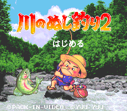
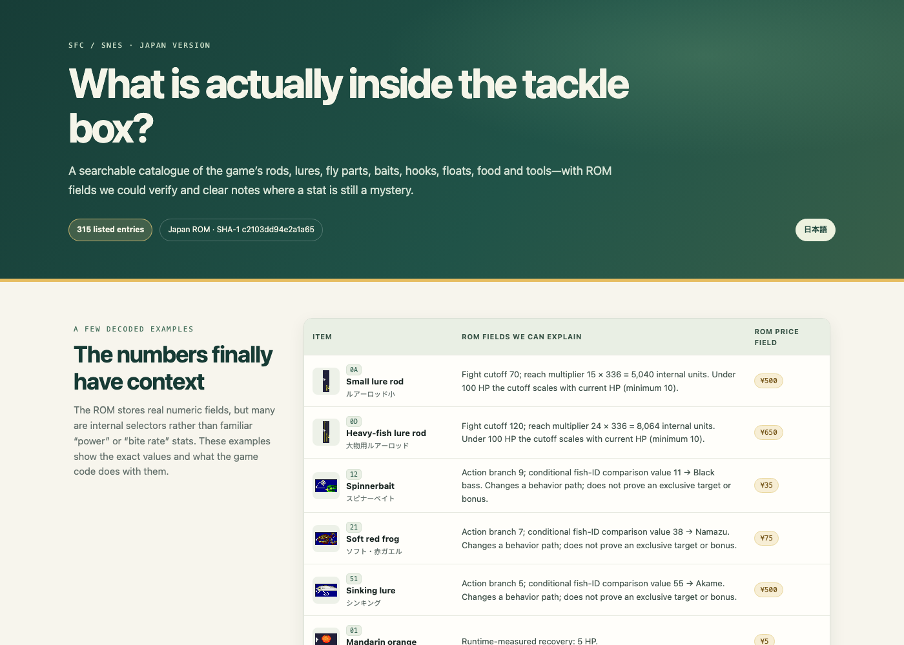

# Kawa no Nushi Tsuri 2 (SFC/SNES) research



An independent, source-linked study of the Japanese Super Famicom release of **Kawa no Nushi Tsuri 2** (『川のぬし釣り2』). The project documents item records, the parts used to make flies, and a small set of effects confirmed by running the game. It does not distribute the game.

**Languages:** [ไทย — item catalogue](https://polaminggkub-debug.github.io/kawa-no-nushi-tsuri-2-research/catalogue/index.th.html) · [日本語](README.ja.md) · [Findings (English)](docs/findings.en.md) · [調査結果（日本語）](docs/findings.ja.md) · [English item catalogue](catalogue/index.html) · [日本語アイテムカタログ](catalogue/index.ja.html)

**Open the searchable gallery:** [English](https://polaminggkub-debug.github.io/kawa-no-nushi-tsuri-2-research/catalogue/) · [日本語](https://polaminggkub-debug.github.io/kawa-no-nushi-tsuri-2-research/catalogue/index.ja.html) · [ไทย](https://polaminggkub-debug.github.io/kawa-no-nushi-tsuri-2-research/catalogue/index.th.html)



## New equipment research — 2026-10-04

**[Visual guide: English](https://polaminggkub-debug.github.io/kawa-no-nushi-tsuri-2-research/research/) · [日本語](https://polaminggkub-debug.github.io/kawa-no-nushi-tsuri-2-research/research/index.ja.html) · [ไทย](https://polaminggkub-debug.github.io/kawa-no-nushi-tsuri-2-research/research/index.th.html)**

- Two lure IDs cover the **mask compatibility** of all 38 lure-eligible fish/creature profiles: one of `17/18/2E/2F/30/31` plus `23/24` (hex). The cheapest ROM base-price pair is `17 + 23`, ¥50; shop availability remains unconfirmed.
- Rod byte `+2` was previously mislabeled as a fight counter. Target movement, B release and the next state identify it as a **pre-hook aim/cast hold-time cutoff**. It is not fight strength.
- Fly body normalization and bait/lure mask checks now have a [reproducible matrix](docs/fish-acceptance-research.md). These are compatibility checks, not measured bite or landing rates.
- [Rod consumers](docs/rod-response-research.md), [lure setup transforms](docs/lure-response-research.md), and [one observed shop menu](docs/shop-inventory-research.md) document exact limits.

Reproduce with your own original ROM:

```sh
python3 scripts/extract_lure_coverage.py --rom /path/to/game.sfc --output /tmp/lure-coverage.json
python3 scripts/extract_fish_acceptance.py --rom /path/to/game.sfc --output /tmp/fish-acceptance.json
python3 scripts/extract_rod_response.py --rom /path/to/game.sfc --output /tmp/rod-response.json
python3 scripts/extract_lure_response_grid.py --rom /path/to/game.sfc --output /tmp/lure-response.json
```

## What is covered

The current research index has 315 entries. A lure or fly-part ID is a distinct game record, even when the game reuses a displayed name.

| Group | Entries | What the count means |
| --- | ---: | --- |
| Rods | 21 | Rod records |
| Lures | 81 | Lure records; repeated names can have different records |
| Fly parts | 134 | 64 body entries, 47 wing entries, and 23 tail entries |
| Hooks and Ayu nose rings | 13 | Hook/ring records |
| Floats and sinkers | 10 | Float, marker, and sinker records |
| Baits | 23 | Bait records |
| Food | 10 | Food and healing items |
| General/quest items and sound choices | 23 | Includes stereo/mono menu choices, not just carried items |
| **Total** | **315** | Research-index entries |

For the directly observed fly-maker options and the limits of the ID mapping, see [the findings](docs/findings.en.md#fly-maker-observations). A record count is not a claim that every gameplay effect has been decoded.

## Reproduce the ROM table extraction

Use your own dump of the Japanese SFC game. The published ROM-specific findings refer to a 1,572,864-byte dump with SHA-1 `c2103dd94e2a1a65a495fc02adc2e7d040f31212` and SHA-256 `e0594921a5a2ef1a2613b9d2e29fed066569e3793393c591bf4c4968a54c0b49`.

```sh
python3 scripts/extract_items.py --rom /path/to/your/Kawa-no-Nushi-Tsuri-2.sfc --output /tmp/items.json
```

The extractor uses Python's standard library. It reads the ROM and writes the requested output file; it does not patch the ROM. If your dump differs, treat the result as a separate build and verify it before comparing records.

An optional runtime-capture helper is available as `scripts/capture.py`; see the [capture instructions](docs/runtime-capture.en.md). It requires a Snes9x-compatible Libretro core supplied by the user, plus Python `numpy` and `Pillow`. The controlled gameplay observations in this repository were made in an isolated emulator run. The original emulator save states used to reach those exact test setups are not included, so recreating the tests requires rebuilding the setup in-game or supplying your own state.

## How to read the findings

- ROM table fields are labeled by the code path that consumes them. A raw value is not presented as a player-facing stat unless its meaning and units are supported.
- Yen values are prices stored in item records. They do not prove that an item is stocked in every shop or available in every stage.
- Food effects below are measured in controlled runs that started at 1 HP. The fish-food rule is limited to the sizes tested; the documentation does not establish every edge case.
- Item names and broad lure/fly families were initially cross-referenced with community lists. The two corrected lure labels, `0x11` and `0x1D`, were checked against the ROM name data and the game menu.
- The fly-maker counts describe one observed early-stage shop. They do not prove later shops have no additional options.
- Images in the catalogue are captures from the game. They are included to identify the items and show the observed interface; their underlying rights remain with the respective rights holders. The repository's software/data license does not grant rights to that material.

## Included and excluded material

The research repository contains curated item data, scripts, bilingual findings, and a compact item gallery. It does **not** contain a ROM, patch, emulator/core binary, save state, full manual scans, or gameplay video. External references are linked in the findings so readers can consult their original context.

The separate six-stage fish maps and quest notes are source-guided gameplay references; they are not part of the ROM-confirmed item findings and should not be cited as decoded ROM facts.

## Sources

- Original SFC instruction manual scan and page references: [『川のぬし釣り2』 manual](https://gamemanual.midnightmeattrain.com/entry/%E5%B7%9D%E3%81%AE%E3%81%AC%E3%81%97%E9%87%A3%E3%82%8A2), especially printed pages 12–29 for equipment and fishing actions.
- Community item-ID lead, treated as provisional until cross-checked: [SFC 川のぬし釣り2 改造コード](https://roadbikebeginners.com/sfc-kawanonushitsuri2-cheat/).
- First-person gameplay notes about lure use and observed behavior: [Lure fishing](https://note.com/holy_heron2678/n/na12caa0f2974?hl=en), [lures breaking during play](https://note.com/holy_heron2678/n/n433005d8fe08?hl=en), and [stream fishing notes](https://note.com/holy_heron2678/n/nf6dccee118e2?hl=en).
- Community item and location observations: [全道具紹介と入手場所](https://wazap.com/cheat/%E5%85%A8%E9%81%93%E5%85%B7%E7%B4%B9%E4%BB%8B%E3%81%A8%E5%85%A5%E6%89%8B%E5%A0%B4%E6%89%80/177794/).
- Early-shop screenshots and custom-fly interface reference: [SFC 釣魚太郎2 walkthrough](https://evaandmaicy.blogspot.com/2014/11/sfc-2_18.html).

Research snapshot: **4 October 2026**. Corrections and better-supported interpretations are welcome; please include the game version, ROM hash, and evidence for proposed changes.
