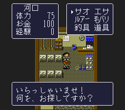

# Area 6: walk from the town entrance to the regular shop

## Player route

Once already in Area 6, use its second town entrance at field `(2,49)`. It arrives in town map 12 at `(7,29)`.

Walk up 3 tiles, right 2, up 3, down 1, left 1. This puts you at `(8,24)`, below the shop counter `(8,23)`. Face up and press A; advance the greeting to the category menu.

The route is shown next to the regular-shop location on the website. The town crop still supplies the counter position, and the field-entrance action preserves the selected item and return context.

## Evidence and limits

Original Japanese ROM SHA-1: `c2103dd94e2a1a65a495fc02adc2e7d040f31212`.

The first route used 33 sequential controller-only requests from an existing Area-6 debug field fixture at `(8,8)`, through the outdoor approach, an ordinary flee from a scorpion encounter, entrance `(2,49)`, town arrival, walking, and shop interaction. Each request loaded only the preceding output state; there were no intervening memory writes. An independent replay reran all 33 requests in a fresh output directory and checked each recorded map/tile. Its final screenshot exactly matched the original SHA-256 `48f39a4450939cabf298f689d8c7ccac6ef90c10ffa2115eb6293bdfb768304e`.

The initial fixture deliberately loads Area 6. This proves the controller route once already there, **not** the story unlock or a natural new-game playthrough. There was no purchase in this replay, so it does not prove unlimited stock or repeat purchase behavior. Emulator states, core, ROM, and WRAM are not distributed.

[Sanitized route and image evidence](../data/area6-shop-walk-evidence.json) records the position checks, fixture hash, entrance, counter and image hash. [ROM shop locations](shop-stock-research.md) remain the source for the seller/table relationship and available offers.
