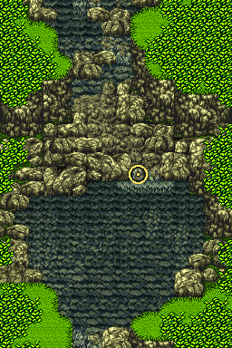

# Gold Net shallow-water location: Area 1

## Finding

Two recorded original-ROM executions confirm that the Gold Net can be used at Area 1 tile **(9,105)**. In the first, the normal field menu was opened, the General Tools list was selected, Gold Net item `04` was chosen, and its regular item dispatcher ran. A second run replayed the selected-item action from the same verified field state. In both, the existing bait item `07` (カワムシ) increased from 0 to 3.

The marked map is an authentic Area 1 field image reconstructed from the original ROM. The ring marks the center of tile `(9,105)`.



## What this does and does not establish

- **Confirmed:** this tile satisfies the ROM's net terrain predicate, the runtime movement mode was shallow-water mode, and the normal item-use menu successfully executed Gold Net here.
- **Observed twice:** both controlled runs added three units of bait item `07`. This repeat is stronger evidence than a single observation, but it does not prove that every use yields exactly three.
- **Controlled preconditions:** the probe inserted Gold Net ID `04` into tool inventory word `$0B5E`; bait ID `07` already existed at `$088C`, and its count at `$08B8` was reset to zero so the result could be observed.
- **Not established:** a normal-play route from the Area 1 entrance to this exact tile, when a player naturally obtains Gold Net, or usable coordinates in Areas 2–6. The other areas remain offline terrain candidates and are omitted from this location list.

This is one confirmed use location, not a complete Gold Net map or a guarantee that every net use yields the same bait or amount.

## ROM and runtime evidence

Source image SHA-1: `c2103dd94e2a1a65a495fc02adc2e7d040f31212`.

The location was checked against the three decompressed field planes and their per-area thresholds:

| Check at `(9,105)` | ROM-derived class | Result |
| --- | ---: | --- |
| Ground class | 5 | Passes the net gate, which rejects classes 8 and above |
| Water class | 12 | Nonzero |
| Depth class | 0 | Shallow-water condition |
| Runtime movement mode `$0858` | 1 | Shallow-water mode |

The classifier is in `$00:8F7D..90C3`; the net-use dispatcher is `$03:BC4A`, with Gold Net ID `04` branching to handler `$03:BF2A`. The field menu path was exercised with ordinary controls: A opens the command panel; Left and Down select General Tools; A opens the list; Down twice selects the third entry, Gold Net; A uses it.

The private replay bundle stores the serialized states, WRAM snapshots, screenshots, and probe requests under `rom-analysis/gold-net-shallow-spots/`. The primary success screen is `runs/area1-net-use-after13.png`; the primary final memory image is `runs/area1-net-use-attempt.wram.bin`. A second independent action replay is recorded as `root-area1-net-confirm.json` with its own post-use WRAM. No external guide supplied the location or result.

## Rebuild the map and terrain verification

From the repository root, provide the matching original Japanese ROM image:

```sh
python3 scripts/build_net_location.py --rom /path/to/Kawa-no-Nushi-Tsuri-2-Japan-.sfc
```

The builder checks the ROM SHA-1, verifies the existing Area 1 map against its manifest, reclassifies the tile from the original terrain bytes, then regenerates `data/gold-net-location.json` and the marked map crop. It does not run the emulator; the two controlled runtime observations remain separately recorded above.

---

# エリア1の金アミ使用地点

## 確認できたこと

記録した2回のオリジナルROM実行で、エリア1のタイル **(9,105)** にて金アミを使用できました。1回目は通常のフィールドメニューから「道具」を選び、金アミ ID `04` を選択しました。2回目は同じフィールド状態から選択済みアイテムの処理を再実行しました。どちらの実行でも、すでに所持枠にあったエサ ID `07`（カワムシ）の数が 0 から 3 に増えました。

地図はオリジナルROMから復元したエリア1のフィールド画像です。黄色の丸はタイル `(9,105)` の中心を示します。

## 確認範囲と未確認事項

- **確認済み:** このタイルはROMのアミ使用地形条件を満たし、実行時の移動モードも浅瀬を示しました。通常のメニュー操作で金アミを使う処理まで動作しました。
- **2回観測:** どちらの管理下実行でもエサ ID `07` が3個増えました。同じ結果を再確認しましたが、毎回必ず3個になるとは確認していません。
- **テスト用に設定:** 道具欄の `$0B5E` に金アミ ID `04` を設定しました。エサ ID `07` は `$088C` にすでにあり、結果を確認するため所持数 `$08B8` を0にしました。
- **未確認:** エリア入口からこのタイルまで通常プレイで歩いて行けるか、通常進行で金アミをいつ入手できるか、エリア2〜6の使用地点。ほかのエリアは静的な地形候補のままで、この地点一覧には含めていません。

このデータは確認済みの1地点だけを示します。全エリアの完全な金アミ地図ではなく、毎回同じエサや個数が得られる保証でもありません。

## ROMと実行時の証拠

対象ROMのSHA-1: `c2103dd94e2a1a65a495fc02adc2e7d040f31212`。

タイル `(9,105)` を、ROMの3つの展開済み地形面と各エリアの閾値で判定しました。

| 判定項目 | ROMから得た値 | 結果 |
| --- | ---: | --- |
| 地面クラス | 5 | アミ使用を拒否するクラス8以上ではない |
| 水クラス | 12 | 0ではない |
| 深さクラス | 0 | 浅瀬条件 |
| 実行時移動モード `$0858` | 1 | 浅瀬モード |

地形判定処理は `$00:8F7D..90C3`、使用アイテムの振り分けは `$03:BC4A` にあります。金アミ ID `04` は `$03:BF2A` の処理へ分岐します。メニューは通常のボタン操作で開きました。

シリアライズ状態、WRAM、スクリーンショット、再生用リクエストは非公開の `rom-analysis/gold-net-shallow-spots/` に保存しています。主な成功画面は `runs/area1-net-use-after13.png`、実行後のメモリは `runs/area1-net-use-attempt.wram.bin` です。独立した2回目の再実行は `root-area1-net-confirm.json` と対応するWRAMにあります。地点や結果は外部攻略情報から取得していません。

## 地図と地形判定の再生成

リポジトリのルートから、SHA-1が一致する日本版ROMを指定します。

```sh
python3 scripts/build_net_location.py --rom /path/to/Kawa-no-Nushi-Tsuri-2-Japan-.sfc
```

生成スクリプトはROMのSHA-1と既存エリア1地図のマニフェストを確認し、元の地形データからタイルを再判定して `data/gold-net-location.json` とマーク付き地図を生成します。エミュレーターは実行しません。2回の管理下の使用結果は別に記録した実行時観測です。
