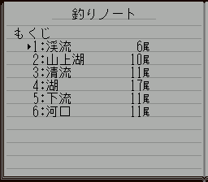

# Completing the Fishing Notebook

Source: the owner-supplied original Japanese ROM, SHA-1 `c2103dd94e2a1a65a495fc02adc2e7d040f31212`. This guide uses the game’s tables and record code, not external walkthroughs.

## The notebook records species globally

The notebook has **66 species slots**, IDs `01..42` hexadecimal. A species appearing in two maps still has one slot. The six pages group the species records by the area in which their current largest-size record was set.

A duplicate of equal or smaller size does not change the best-size or area record. A strictly larger size updates it and can move the single entry to the new area. Therefore, there is no fixed number that every area page must reach: larger records elsewhere can change page counts. The global target is 66 distinct recorded species.

## Suggested collection route, stages 1 → 6

This route assigns every species to the first numbered stage in which its spawn table contains it. It is a convenient checklist route, not a game restriction or a promise that the notebook’s page counts stay fixed.

| Stage | Recordable species found here | New species in this route | Already listed earlier | Cumulative distinct target |
| --- | ---: | ---: | ---: | ---: |
| 1 | 6 | 6 | 0 | 6 |
| 2 | 12 | 10 | 2 | 16 |
| 3 | 15 | 11 | 4 | 27 |
| 4 | 22 | 17 | 5 | 44 |
| 5 | 27 | 11 | 16 | 55 |
| 6 | 15 | 11 | 4 | 66 |

If you already recorded a species through another route, skip it when collecting new species. You can still pursue it for a larger-size record. The website guide does not read the emulator save or claim to know your actual progress.

### Why the in-game area count differs from the route count

For Area 3, **15** eligible species occur in the spawn table: **11** first appear at this stage on the suggested route and **4** also occur earlier. These are guide classifications, not the current save's area-page count. If the in-game page displays **13**, that means 13 species currently have their notebook area word set to Area 3. A species can be recorded on another area's page even though it is also available here.

To determine overall completion from the notebook contents page, add its six current page counts. Each recorded species belongs to one area page, so this sum is the current number of distinct recorded species; compare it with 66. Do not add the website's six available-species totals, because they include species shared between areas.

Each stage also contains one profile outside the 66 notebook slots: `44..49` respectively. The notebook updater rejects IDs above `42`; these extra profiles do not fill additional notebook slots. Profile `43` is unmapped. The guide retains these fish/creature entries in the general map catalogue and marks their notebook exclusion separately.

## Evidence and reproducibility

- Item `05` (`釣りノート`) opens notebook state 8 via `03:C05C..C071`; state dispatch calls `01:9738`, then list builder `01:BF30`.
- `01:BF30..C00B` scans 66 area words at `$0C3C`, puts IDs with area 1–6 into the corresponding lists in `$7F:2AFA`, and writes six cumulative byte boundaries at `$7F:2A8E..2A98`.
- Record updater `01:8B00..8C8F` indexes species by `2*(id-1)`. It compares selected size `$1EB1` against the existing best at `$0DC8+X`, and writes the current area `$085A` to `$0C3C+X` only on a strictly larger record. IDs above `42` are rejected.
- `01:CED7..CEE4` displays Area 3’s current page count as `($7F:2A92 − $7F:2A90) / 2`; those values are the Area 3 and Area 2 cumulative byte endpoints. This counts unique species assigned to that page, independently of the fish’s update counter at `$0E4C`.
- `01:C258..C2EA` sorts lists using the corresponding values in `$0CC0` and `$0D44`.
- Six map ID tables start at CPU `0C:C800` (file `0x064800`), each 256 two-byte rows, separated by `0x200`. Duplicated rows count once per species in this guide; they are not additional notebook slots.

[Dataset](../data/notebook-completion.json) preserves all membership, route additions, repeats and exclusions. [Extractor](../scripts/derive_notebook_completion.py) reproduces it from a matching privately supplied ROM. No ROM or emulator state is published.

The record updater and notebook grouping are established by the traced code. The precise visible event that first calls the updater still requires a natural encounter/landing replay; this guide does not promise that a bite alone is sufficient. Completing the notebook is not asserted to be the same as completing all quests or endings.

## Original-game notebook display check

The 66 record area words were injected according to this route, then the notebook item was opened with ordinary input. The original renderer displays 6/10/11/17/11/11. This is a display/grouping fixture, not a natural completed playthrough. The cumulative byte boundaries were 12/32/54/88/110/132. [Image provenance](../data/notebook-image-evidence.json). [Exact instruction verifier](../scripts/verify_notebook_records.py) and [verified record evidence](../data/notebook-record-evidence.json) preserve the eligibility/comparison/area-store paths.

A separate eligible-update counter at `$0E4C+2*(id-1)` increments before the size comparison, saturating at 1000. Equal/smaller updates therefore can affect that counter even while the best size and area stay unchanged. `01:D300..D30C` reads it for decimal rendering, but this trace does not establish it as successful landed-catch count. It is not part of the distinct-species checklist.
