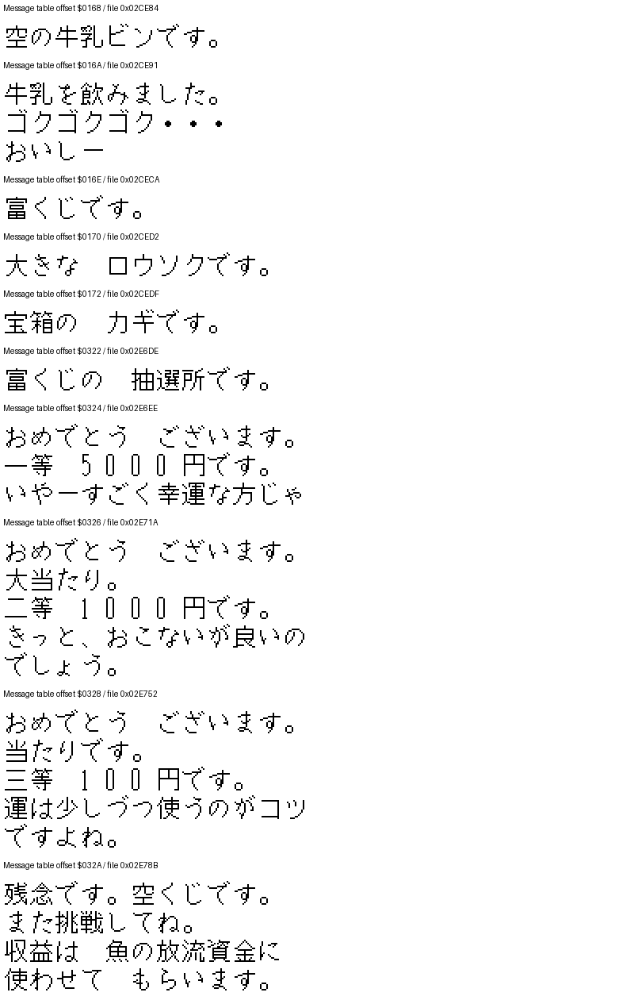

# Postcards, milk, lottery and event items: original-ROM research

This note follows the selected-use handlers and event/NPC branches for general-tool IDs `06`, `07`, `0F`, `10`, `11`, `12`, `15`, `16` and `17`. It uses only the supplied original Japanese SFC ROM (1,572,864 bytes; SHA-1 `c2103dd94e2a1a65a495fc02adc2e7d040f31212`). No walkthrough or fan-guide claims are used as evidence. English and Thai descriptions translate the ROM's behavior and decoded Japanese messages.

The machine-readable entries, including English/Japanese/Thai player-facing copy and per-item raw trace addresses, are in [quest-tool-use.json](../data/quest-tool-use.json). The selected-use dispatcher and raw item records are indexed by [general-tool-code-index.json](../data/general-tool-code-index.json). The text previews are rendered directly from the original ROM font:

## Player-facing results

| ID | Item | What the traced code lets the player do |
| --- | --- | --- |
| `06` | Received postcard (`届いた絵はがき`) | Read local postcards and story notices for the selected saved character. When the doctor's notice appears, use the Area 6 Magnet to find the requested giant eel (fish ID `3B`) at `(41,8)`. Reading does not consume the item or grant a reward. |
| `07` | Postcard (`絵はがき`) | Send mail to another saved character. Pick a recipient and confirm. If an earlier postcard is still undelivered, the game asks whether to remove it first. A completed send consumes the postcard. |
| `0F` | Milk bottle (`牛乳ビン`) | Before opening the area-3 town chest `(6,4)`, leave one space in the general-tool inventory. Take the bottle to the cow in area 3 `(6,103)`; its event replaces the bottle with milk. Selecting the empty bottle itself only shows its description. |
| `10` | Milk (`牛乳`) | Drink it to fill current HP to maximum; it becomes an empty bottle. Or give it to the canoe maker in area 3 `(28,39)` to receive canoe `02`. |
| `11` | Lottery ticket (`富くじ`) | One ticket is consumed at the area-5 lottery counter `(54,22)`. The ROM has 100-, 1,000- and 5,000-yen prize branches plus a losing branch. A chest in the area-5 town `(4,6)` contains a ticket; no key is needed. Offering food at a Jizo improves the lottery threshold; the area-5 Jizo is at `(49,22)`. |
| `12` | Candle (`ロウソク`) | Give it to the NPC in area 6 `(47,36)` to complete the signal/reunion event. For saved character 1, follow-up dialogue points to a huge red-eyed Akame in the deep northwest of the lake; this line is a clue, not proof of an exact spawn tile. A locked chest in the area-6 town `(4,6)` contains the candle. |
| `15` | Fried tofu (`あぶらあげ`) | Eating it fills current HP to maximum and consumes it. Giving it to the area-4 quest NPC `(32,42)` advances the fox story and opens the fireworks follow-up. |
| `16` | Fireworks (`花火`) | In area 4, use it at any tile in `X=31–33, Y=42–43` to trigger the fox scene before it has happened: the fox is startled, appears, then runs away. This direct route does not require the fried-tofu step. The item is consumed. |
| `17` | Key (`カギ`) | Interact with locked chests in the towns for areas 1, 2, 4 and 6. It is retained after opening them. The rewards are potato bait, waxworm bait, a small lure rod and a candle, respectively. Leave room in the corresponding inventory before opening a chest. |

Coordinates are the ROM's map-tile `(X,Y)` pairs, not screen pixels. The game has six visible outdoor areas; internal map IDs `7–12` are the towns/interiors attached to outdoor areas `1–6`. Prices below are raw item-record values, not evidence that an item is stocked by a shop.

## Trace notes

### Postcards

- The item-use dispatcher at `03:BC4A..BD2E` routes `06` to `03:C072` and `07` to `03:C0E4`.
- `06` is accepted from the field action state and enters action state `09`. State dispatch at `00:8010..8032` routes this to `01:9FD6`, which scans the saved mail blocks at `7F:1B0A`, `1BB6`, `1C62` and `1D0E` for the current-character selector (`7E:0860`). Story-message branches are also selected from saved progress flags. The read mode does not run the acknowledgment write used by the other mail display path. The handler contains no HP/money write and no item removal.
- `07` enters action state `10` after recipient/pending-mail confirmation. The send path at `01:E2E2` records current-character and area data. Completion at `01:E46D..E4A3` compacts the inventory and removes ID `07`, then returns action state to `01`.
- The ROM message table entries `025A`, `025C` and `025E` respectively say there is no recipient, the previous postcard has not arrived, and ask whether to delete the previous postcard and send this one. Eligible recipients are other saved-character records at `70:0010`, `70:04E0`, `70:09B0` and `70:0E80`; the current character is excluded.
- The send handler checks action state `02`, the mode bound at `7E:0858`, and excludes area `13`. The item record lists a 10-yen base price, but this alone does not establish that a shop sells it.

### Doctor notice and Area 6 Magnet

The received-postcard reader can generate a doctor notice from ROM message `041E`:

> `医者の私が、病気になってしまいました。病気を治すには、大ウナギを食べなくてはなりません。釣って下さい。待っています。`

The reader shows this notice when `$0C18` bit `0x02` is already set, bit `0x04` is still clear, and at least `0x41` (65) of the 66 two-byte species-record slots at `$7E:0DC8..$7E:0E4A` are nonzero. The counter advances by two bytes per slot, so this is 65 recorded species slots, not 65 repeated catches. On that same read, `01:DEB3..DEB9` sets bit `0x04`; the message copy/setup starts at `01:DECC`. The reader grants no item reward and does not establish that the eel has been caught.

The practical step after seeing the notice is to use the Magnet in Area 6. The separate Magnet trace resolves its dynamic target to fish-table row 1: giant eel `オオウナギ`, fish ID `3B`, tile `(41,8)` ([Magnet gate evidence](magnet-story-gate-research.md), [machine-readable trace](../data/magnet-story-gate.json)). This is the Magnet's target location; the notice and heading alone do not prove a successful catch.

The prerequisite bit `0x02` is set by a separate automatic return scene, not by reading postcard ID `06`. The transition handler at `00:9E43..9E5F` queues state `0x0C` when `$0C18 == 1` and the paired Area 1 route reaches map selector `7`, tile `(7,13)`; the transition table pairs it with Area 1 tile `(8,183)`. The state dispatcher `00:8010..8032` enters `00:8259 → 02:DF8C → 02:E5F5`; after the selected-profile scene, `02:E643..E649` ORs bit `0x02` into `$0C18`. No NPC or item check is part of this bit-setting tail. The earlier fishing callback can set `$0C18=1` when the selected profile matches an active fish-table row, but it does not explicitly test a landed-catch result. Static evidence therefore does not establish whether the player must start that encounter, get a bite, win the fight, or land the fish before the return scene can run.

### Empty bottle and milk

- `03:C4D9` handles direct use of `0F`: it displays message `0168` (“It is an empty milk bottle”) and has no other effect.
- Before opening the area-3 town chest at `(6,4)`, leave one space in the general-tool inventory. The chest handler (`00:D0EA..D113`, file offset `0x0050EA`) grants `0F` through the shared routine at `00:D1D4..D207` and sets `7E:0C1A` bit 0 only after a successful grant. The shared routine checks the last general-tool slot at `7E:0B78`; if it is occupied, it displays full-inventory message `0196` and returns status `1`. The chest caller sees status `1` and exits before setting bit 0. These instructions describe the traced full-inventory branch; persistence or retry behavior after saving/reloading that attempt was not established.
- With bit 0 set and bottle `0F` in inventory, the cow at area 3, NPC slot `0C`, `(6,103)` replaces the bottle slot with milk (`00:C804`). This traces the item's refill/exchange use rather than attributing a result to the empty-bottle description.

The capacity check is directly visible in the supplied ROM bytes: at file offset `0x0050EA`, the chest handler calls `D1D4`, compares its result with `1`, and branches out before the flag write; at file offset `0x0051D4`, the shared grant routine loads `$0B78`, and its occupied-slot branch selects message `0196` and returns status `1`. The ROM SHA-1 is recorded above.
- `03:C4EA` handles direct use of milk. It copies maximum HP `7E:0864` to current HP `7E:0862`, changes the selected inventory entry to `0F`, and shows message `016A`.
- A separate area-3 exchange at NPC slot `1A`, `(28,39)`, checks for milk and grants canoe `02` (`00:C8EC..C8FD`). Messages `02B8` and `02BA` ask for fresh milk and confirm the canoe. Thus milk has both a healing use and a progression trade; drinking it first leaves the empty bottle, not milk for the trade.

### Lottery ticket and threshold

- ID `11` is granted by the keyless town chest for outdoor area 5 at `(4,6)` (internal map ID 11; `00:D158..D181`). Its item-record base price is 100 yen; shop availability is not inferred from that field.
- Outdoor area 5 NPC slot `18`, `(54,22)`, is the lottery counter (`00:CB6B..CBD9`). It checks for ID `11`, removes it, then compares a table-driven random byte from `00:DA92 -> 00:EDE9` against `7E:0C22`. A byte greater than or equal to the threshold loses; a lower value reaches prize selection. Follow-up table/random-bit branches award 100, 1,000 or 5,000 yen (messages `0328`, `0326`, `0324`); `032A` is the loss message. The trace does not justify an independent/uniform percentage claim.
- Jizo interactions use food items, not fish. The area-5 Jizo at `(49,22)` is nearby. The offering branch at `03:A3DF..A490` adds the selected food record's first byte to `7E:0C22`, capped at 255; the food table begins at `05:B1DF`. This value is not fish size. For example, the ROM food records add 40 for bento/daikon, 35 for fish, and 0 for poison mushroom. The message `026C` asks what to offer; `026E` confirms the offered food.

### Candle, fried tofu and fireworks

- The locked chest for outdoor area 6 at `(4,6)` (internal map ID 12) grants candle `12`. Directly selecting the candle only displays message `0170` (“a large candle”). The event handler is `00:CE73..CE8F`: area-6 NPC slot `22`, `(47,36)`, checks for the candle and consumes it before calling `02:DFA0`. The event sets `7E:0C1C` bit 2. Message `033A` says the signal is awaited; `033C` accepts the candle; later lines `0350`/`0352` name the returning characters. Message `0340`, shown only when saved-character selector `7E:0860` equals 1, describes a huge red-eyed Akame in a deep place northwest of the lake and calls it the pair's guardian. The dialogue itself does not identify an exact fish-map tile.
- Direct use of fried tofu `15` at `03:C5C0` restores HP to maximum and consumes it (message `016C`). In area 4, NPC slot `0C` at `(32,42)` also checks for and consumes `15` (`00:CA1C..CA43`), setting `7E:0C1C` bit 0. Message `02FE` thanks the player and says the character needs more food before moving. This flag opens the nearby fox/fireworks dialogue path.
- Fireworks `16` are usable only in the field/action contexts and areas 1–6 accepted by `03:C5F6`. The handler consumes the selected item. At area 4, while `7E:0C1A` bit 7 is clear, player tiles `X=31..33`, `Y=42..43` enter action state `0E`; state dispatch routes this to `02:DF9C`. That sequence sets `7E:0C1A` bit 7 and `7E:0C1C` bit 0. Messages `0300`/`0302` say the firework is used and the fox appears startled, reveals itself and runs away. This direct-use branch does not check whether fried tofu was given first.
- After the area-4 tofu interaction has set its story flag, quest NPC slot `0C` at `(32,42)` can also consume fireworks and call `02:DF9C`. A separate area-4 NPC slot `1E` at `(62,32)` accepts fireworks without that prerequisite (`00:CAFB..CB1E`): it consumes the item, enters action state `0F`, and displays `02E6`, which recommends fireworks to scare the fox. This is a hint interaction; the message alone is not evidence that the fox scene occurred.

### Key and chest contents

- Selecting key `17` directly at `03:BD1B` only displays message `0172` (“a treasure chest key”). The chest consumer is `00:CFB1..D059`; it checks inventory for ID `17`, marks a chest open and grants its item in the listed town maps. The key is not removed on this route. A locked chest without a key shows message `0270`; an already-open chest shows `0262` (“there is nothing inside”).
- Reward capacity is checked separately: bait chests test `7E:0B36`, the rod chest tests `7E:0B06`, and the candle uses the general-tool inventory path. A full relevant inventory displays `0196`. The chest is marked open before this capacity check; whether a no-room result persists after reload was not traced, so no permanent-loss claim is made. Leave room in the matching inventory before opening these chests.

| Outdoor area | Town map ID | Chest tile (X,Y) | ROM reward |
| --- | --- | --- | --- |
| 1 | 7 | `(5,68)` | Potato bait `11` |
| 2 | 8 | `(4,6)` | Waxworm bait `0B` |
| 4 | 10 | `(4,6)` | Small lure rod `0A` |
| 6 | 12 | `(4,6)` | Candle `12` |

## Evidence limits

- All item behavior above is tied to original-ROM code paths and decoded Japanese text. The English and Thai prose is explanatory translation.
- A raw record price is not treated as proof of where the game sells the item.
- A dialogue hint about a fish is not substituted for the game's fish appearance table; the candle text identifies a general deep-water direction, not an exact coordinate.
- Lottery behavior is described as its actual threshold and prize branches. No unsupported hit-rate percentage is inferred from a table-driven random routine.
