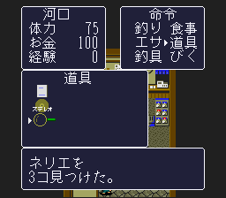

# Obtaining paste bait 0D in town

## Finding for the player

General tool ID `03` (magnifier) can award bait ID `0D` (`ネリエ`) in town maps 7–12. The handler reads the player's Y tile at `$085E` and selects bait `0D` when `($085E & 0x00F0) == 0x0010`. Town maps in this game are 128 tiles high, so the passing band is **Y 16–31**. X is not part of this branch. The item-use handler also requires the normal field state ($0834=2), raw movement state 0 or 2 (state1 and3+ are rejected), and a tile different from the one where the magnifier was last used. The handler remembers one X/Y pair; it does not track a history of all visited tiles. Stopping before use is practical advice, not a proof that only stationary state0 works.

The recorded second entrance for every town (ordinal 1) arrives at **(7,29)**. The location index maps outdoor stages 1–6 to interior map IDs 7–12, and the common ROM arrival table at file offset `0x2049` records `(7,29)` for that entrance. Thus `(7,29)` is a ROM-backed candidate in each town. Direct controller use was confirmed only in town map 12; the other five candidates follow from the identical area branch and recorded arrival coordinates, not six separate runtime trials.

When there is room in the bait inventory, the shared grant code draws `(random byte & 3) + 1`, then clamps the addition to the remaining capacity of a stack capped at 9. The amount is therefore 1–4 in a fresh slot, and can be lower when adding to an existing stack. This does not establish a fixed amount per town or a uniform drop probability.

## Runtime capture

The original-ROM controller probe used the existing Area 6 debug field fixture, entered town map 12 at `(7,29)`, opened the general-tool list, selected magnifier ID `03`, and used it. The game displayed **「ネリエを 3コ見つけた。」**. Watched WRAM changed from bait slot ID/count `$0892/$08BE = 0/0` to `0D/3`. The probe request writes only tool ID `03` at `$0B5E`; it does not seed bait `0D`.

This is a successful controller test for one town and one random outcome. The seed manifest explicitly labels its origin as a debug field fixture, not a natural new-game progression save. It does not prove a natural route through the game's progression or directly test towns 7–11.

## Other acquisition sources checked

- The shop extractor decompresses the six original-ROM stock lists; none offers `bait:0D`.
- The existing original-ROM town-chest index has no `bait:0D` reward. This is limited to the chests traced by that dataset; it is not a proof about every NPC or event script.
- The verified positive magnifier route means the current catalogue statement “no other acquisition route is inferred” is outdated. The shop statement remains true.

The item record names ID `0D` `ネリエ` and caps stacks at 9. The Thai patched-ROM label dataset has `nameTh: null` and `captureStatus: unavailable-unverified` for this bait. A descriptive Thai gloss may be used, but no exact Thai-ROM label is confirmed by this evidence.

## ROM fingerprints and reproduction

Source ROM: headerless, 1,572,864 bytes; SHA-1 `c2103dd94e2a1a65a495fc02adc2e7d040f31212`; SHA-256 `e0594921a5a2ef1a2613b9d2e29fed066569e3793393c591bf4c4968a54c0b49`.

The verifier checks the selected-item dispatcher (`03:BC6F`), magnifier state/duplicate-tile gates (`03:BDBD`), map split (`03:BE02`), town Y-band and ID selection (`03:BE75`), stack lookup/cap (`03:BEA6`), and quantity draw/clamp (`03:BFDE`). It also checks the shared random-byte routine (`00:DA92`, `00:EDE9`) and the 256-byte table at `00:EDFA`, SHA-256 `a55490a3bd21b09c02cb237002e5a6cbddba52d3080a0e077f2f44b2d4f9e2d0`.

Reproduce the code/table checks with a privately supplied original ROM:

```sh
python3 scripts/verify_town_paste_bait.py /path/to/original.sfc
```

The verifier checks the original ROM, area/town crosswalk, shop lists, item record, and archived public capture metadata/hash. It does not rerun the emulator. No ROM, core, savestate, or memory dump is included.



[Public evidence and fixture limits](../data/town-paste-bait-evidence.json).
