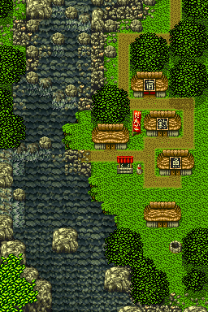
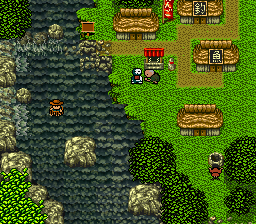

# Tub boarding at a confirmed Area 1 example

## Player action

If you already own a tub, start at the Area 1 house exit `(8,183)` and walk four tiles Left to the pictured tile `(4,183)`, use the tub from General Tools, dismiss the message saying it is floating on water, then press **Left**. The continuous original-ROM probe entered tub travel mode after this sequence. This is a tested example, not a direction rule for every shore. The tub's separately traced acquisition remains the Hariyo exchange in Area 2.





## Evidence

The ROM SHA-1 is `c2103dd94e2a1a65a495fc02adc2e7d040f31212`; Snes9x libretro core SHA-256 is `8ed333ac04544cc6ab67ceb445d095f7600bb17586d4887d99117fbd1ef776f6`.

The start is a naturally reached field state: area 1, position `(4,183)`, movement mode 1. The isolated setup adds only tub ID `01` to the third general-tool slot at `7E:0B5E`. It does not inject coordinates, terrain, story flags, or money. The regular menus place the tub; A dismisses the message; one frame of Left followed by 120 neutral frames finishes at field state 2, movement mode 3, position `(3,187)`. Mode 3 is the tub dispatch at `00:836E`; see [tool-use dispatch](general-tool-actions-research.md) and [boat movement](boat-movement-research.md).

The coordinator reran the continuous probe and observed the same final values. Independent same-state controls found Left entered mode 3, while Up, Down, Right, A, B, and neutral alone stayed in mode 1 at `(4,183)`.

The [structured observation](../data/tub-boarding.json) records the setup, before/after values, screenshot hash and request hash. The clean gameplay screenshot SHA-256 is `2a418b8f8b44a2ae9ca79b3b8961fe891e5b36c45b4a5944b8cdf097d0b97898`. The continuous request SHA-256 is `fee111881dc8ba684bf576eefe1f8ddeee0b9ce03ad54941079acba7c32ae219`.

## Limits and reproduction boundary

This probe establishes use and boarding when a tub is owned. It does not establish acquisition by playing from a new game, canoe boarding, or every destination reachable by tub. The seed, ROM, core and save states remain private and are not distributed. A reader with their own ROM can reproduce the visible menu/directional sequence at this tile; the published observation is not a self-contained emulator replay.

The terrain crop uses the recorded field-map projection and verifies the full terrain image against its manifest SHA-256. The portrait pin on the website identifies the starting tile; the screenshot shows the later state after boarding, not that starting tile.

A bounded verifier for the original-ROM assignment bytes and published screenshot fingerprint is available:

```sh
python3 scripts/verify_tub_boarding.py <original-Japan-ROM>
```

Its PASS does not replay boarding; the continuous runtime experiment and the verifier have distinct scopes.

## Direct walking example

A separate input-only probe started from the verified fresh-game field entry `(8,183)` and held Left for 64 frames, captured in eight 8-frame intervals. Checkpoints were `(8,183)`, `(7,183)`, `(6,183)`, `(5,183)`, `(4,183)`. After 30 neutral frames it remained in field state 2, area1, movement mode1 at `(4,183)`. There were no memory writes or inventory setup. The coordinator reran this request successfully. This establishes the short walk from the house exit to the use point; it does not prove owning or obtaining a tub in a new game. The walking and boarding probes have different seed states and remain separate evidence.
